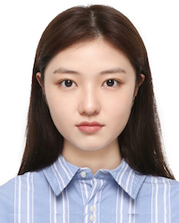

## Zhang Yifan (张一凡)
  
(+86) 15216679198  
(+852)98159326  
u3598307@connect.hku.hk  

### Education
University of Hongkong	
September 2022-December 2023  
MSc in Information Technology Education

Shanghai Normal University	
September 2015-June 2019  
•	B.S in Computer Science and Technology (normal).   
•	Relevant Coursework: Programming and Data Structures, Data Structures and Algorithms, Operating Systems, Algorithm Analysis and Design, Network and Communication, Artificial Intelligence, Android Application Development

### Computer Skills
Languages  
•	Strong Understanding Of: C#, C, JavaScript, Python, HTML  
•	Platforms/Frameworks: Android, Unix API, Node.js, Unity3D, MATLAB  
Others  
•	Well-versed in Unix and Linux command line environments. Comfortable with Github.  

### Publications
[1] Yifan Zhang et al. Recognition of Foreign Objects in Food Images Using Support Vector Machine. Frontier Computing - Theory, Technologies and Applications, FC 2019. Pages: 667-674. (EI Compendex, Accession number: 20201308356183. ISSN: 18761100.)  
[2] 上海师范大学. 基于弱监督的图像寓意分割算法软件V1.0.著作权登记号：2018SR138415.  
[3] Evaluating the Effectiveness of Common Detectors on Contents Generated by AI Tools with Advanced Prompting Techniques. CITER 2023.  

### Research Experiences
#### ChatGPT detection tool development (based on NLP, computational linguistics, and metadata)
March -May 2023  
•	be responsible for developing resources for projects.  
•	collecting and analyzing evaluation data at various stages of the project performing literature review   

#### Foreign Object Detection in X optical image based on Machine Vision
May 2018-March 2019  
•	Implemented segmentation of the X-ray image by automatic threshold method.   
•	Optimized the selection of feature parameters of pattern recognition to serve as the criterion of classification.  
•	Designed the SVM classifier which has high recognition rate and can automatically classify various foreign bodies.  
Production:  Proposed a foreign body recognition method based on SVM for food image.  

#### Image Segmentation of Cow via Weak Supervision
September 2017-March 2018  
•	Constructed segmentation of images into regions with consistent image features (color and texture features, etc.) by Mean-Shift algorithm.  
•	Conducted the preprocession of the image and extracting the saliency map.  
•	Achieved the optimal semantic segmentation of cow image by eliminating over segmentation by chain code difference.  
Production:  Proposed an effective algorithm of cow image semantic segmentation based on weak supervision.  

### Activities
#### Shanghai Jiao Tong University VR winter vacation training
January 2018  
Major responsibilities: Implemented 3D modeling and compiling the main game program by using Unity engine, C#.  
Production: Implemented "SHOGUN", a 3D shooting game.  

